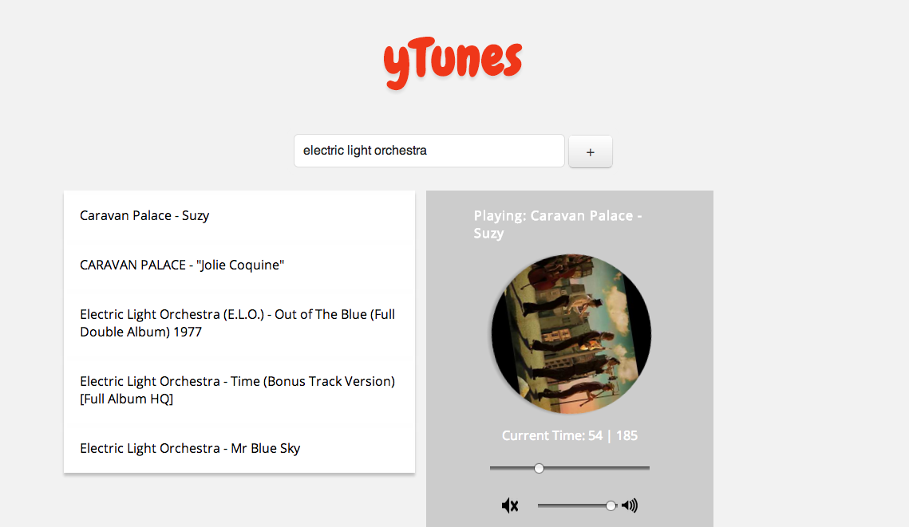

yTunes
======
###All the songs you want, powered by the  API

Built for [Hack n Roll 2013](http://hacknroll.nushackers.org/) @ NUS COM1 Basement in less than 24 hours.
This is the raw, unedited version of the app built over the period of the hackathon.

yTunes is a minimal music service web app, in the same spirit of Spotify and Rdio.
You can listen to, curate, and share your favourite music instantly without hassle.
**Try it out [here](http://leventhan.github.com/yTunes).** (Somewhat buggy due to Youtube embed restrictions.)
[Presentation slides link.](https://docs.google.com/presentation/d/1F3IIA6KrfRyYsowzsbBO_6YxG4iIvndQ_8pN6T56YZE/edit?usp=sharing)

Post-hackathon thoughts/things learned:
- A hackathon is a poor environment to learn new technologies i.e. Backbone for the first time
- if you're using an API that is still experimental/under development, you're gonna have a bad time
- Hackathons are great to practice using semi-familiar technologies to build a real product/demo
- You're not building a web service, you're building a *demo* of a web service
- The demo/presentation is a critical component: Rehearse, rehearse, rehearse!
- You need to define the problem more clearly and actually walk through the app, assume the audience knows nothing about it
- Boil down your 24 hours to five minutes of awesome (i.e. I need to do more presentations)
- Overall, I had a blast building yTunes and seeing the other cool projects/hacks
- Looking forward to next year's hackathon! Hope I can win something next time :)

